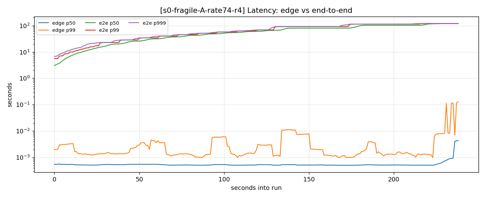
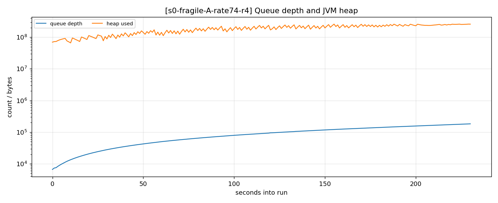
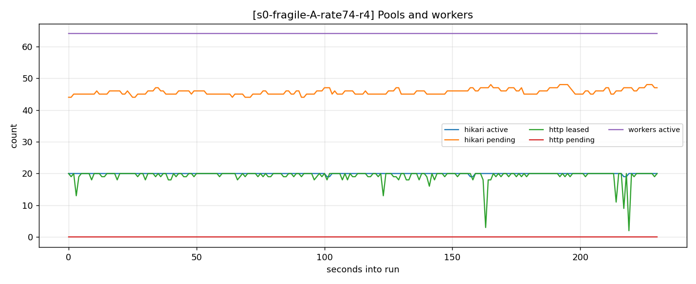

# Results

What a write-heavy Spring Boot ingestion service does when you push it past capacity, and
which resource actually runs out first.

Full working record, including open questions and claims that did not survive review:
[docs/lab-notebook.md](docs/lab-notebook.md).

## Configuration

| Parameter | Value |
|---|---|
| workers | 64 platform threads (virtual threads explicitly disabled) |
| HikariCP max pool | 20, min-idle = max |
| HTTP client pool | 32, deliberately above Hikari |
| downstream latency | 25 ms +/- 10 ms |
| batch | 20 events x ~1 KB |
| gateway | 2 CPUs / 512 MB, heap 256 MB, `-XX:+ExitOnOutOfMemoryError` |

Load is generated by k6 with a **constant-arrival-rate (open) model**; a closed model
self-throttles when the system slows and hides the phenomenon. Prometheus scrapes at 1 s.
Every run asserts its configuration before generating load and its offered rate afterwards.

## 1. Capacity is set by a pool, not by the database

A worker takes a Hikari connection, INSERTs, then calls downstream **while still holding it**,
and only then commits. So:

```
capacity = poolSize / holdTime = 20 / 26.5 ms ~= 754 events/s
```

Measured 754 ev/s against 700 predicted from Little's Law before the first run — 7% under.

Sweeping the pool size confirms the relationship over an eightfold range:

| pool size | measured capacity | per connection |
|---|---|---|
| 5 | 178 ev/s | 35.7 |
| 10 | 366 ev/s | 36.6 |
| 20 | 748 ev/s | 37.4 |
| 40 | 1,508 ev/s | 37.7 |

Linear to within 5.6%. The 5.6% is systematic rather than scatter and its cause is unresolved
— see the notebook.

## 2. The collapse

Three conditions, n=3 each, randomized order, `events` truncated before every run. Medians
with [min-max].

| | offered | accepted | **completed** | edge p99 | e2e p99 | queue peak | outcome |
|---|---|---|---|---|---|---|---|
| 1x | 740 | 740 | **740** | 2.0 ms | 66 ms | 52 | survived |
| 2x | 1,480 | 1,480 | **719** [713-722] | 1.5 ms | 91,143 ms | 180,668 | **died at 228 s** |
| 4x | 2,960 | 2,960 | **586** [544-596] | 16.2 ms | 51,030 ms | 169,080 | **died at 64 s** |

Both deaths are JVM heap exhaustion (`exit=3`, `oom=false`), not a kernel OOM-kill.

**Accepted equals offered exactly at every load.** The service returned 202 to 100% of
requests right up to the moment it died.



The two lines are the whole story. `POST /events` returns 202 the instant an event is
enqueued, so edge latency measures enqueue time and stays at 1.5 ms. End-to-end latency —
enqueue to downstream acknowledgement — reaches 91 seconds.



## 3. Which resource saturated, and how the rest followed

```
hikaricp_connections_active    20     pegged at max
hikaricp_connections_pending   45     64 workers - 20 connections, FLAT
overload_http_pool_leased      19     never approaches its max of 32
overload_http_pool_pending      0     nobody ever waits
```



1. A connection is held across a ~25 ms network call, so capacity is `20 / 26.5 ms`.
2. Above that, the unbounded queue absorbs the excess at exactly `offered - 754` per second.
3. Queue depth sets end-to-end latency (`depth / drain rate`) and heap (~1.1 KB per event).
4. Heap reaches 256 MB and the JVM exits.
5. The HTTP pool is never contended — structurally, since a worker cannot reach the HTTP call
   without already holding a database connection.
6. Postgres is *inferred* not to have been the constraint. Its CPU was never scraped; what
   supports the inference is capacity scaling linearly with pool size to 1,508 ev/s, which a
   database-bound system would not do.

**Saturation itself does not get worse.** `hikari_pending` pegs at 45 and stays there whether
you are at 2x or 20x. An alert on `pending > 40` fires once and then reports nothing about how
bad things are getting.

## 4. Overload makes the system slower

Capacity is not constant under load. At 4x it falls to 586 ev/s — 20.8% below baseline — and
the GC series says why:

| | GC pause per second | capacity vs 1x |
|---|---|---|
| 1x | 0.004 s | — |
| 2x | 0.047 s | -2.8% |
| 4x | **0.199 s** | **-20.8%** |

The gateway runs SerialGC (JVM ergonomics, 2 CPUs / 256 MB), which is entirely
stop-the-world. At 4x it spends 19.9% of every wall-clock second paused against a 20.8%
capacity loss — a ratio of 1.05. Every worker halts for that fraction of the time.

That is the death spiral: overload fills the heap, filling the heap costs GC time, GC time
cuts capacity, reduced capacity deepens the deficit.

*(At 2x the correspondence is weaker — ratio 0.60 to 0.99 depending on the baseline chosen.
The notebook explains why the baseline is soft there.)*

## 5. What this says about the design

The unbounded queue added **no capacity whatsoever** — completion was ~754 ev/s at 1x, 719 at
2x, 586 at 4x. Flat, then worse. What it changed was the *consequence* of exceeding capacity:
instead of refusing work it could not do, the service accepted all of it, reported success,
converted the excess into latency debt and heap, and died.

Worth noting `Executors.newFixedThreadPool(n)` is backed by an unbounded `LinkedBlockingQueue`.
The idiomatic way to make a thread pool in Java has this failure mode built in.

## 6. Not yet measured

The four protections — client timeouts, a bounded queue with a fast 429, token-bucket
admission control, and a circuit breaker — are specified and flagged in configuration, but
**none has a measured delta yet**. Timeouts and the bounded queue are implemented behind
flags; admission control and the breaker are not wired.

Each will be measured against the baseline above, one at a time, on the same load profile.

## Reproducing

```bash
RATE=74 DURATION=5m ./scripts/run-stage.sh s0
```

Writes `results/<run>/` with the raw Prometheus series, k6 summary, preflight assertion and
container exit state, and renders the graphs above. Every number here regenerates from a
re-run.
