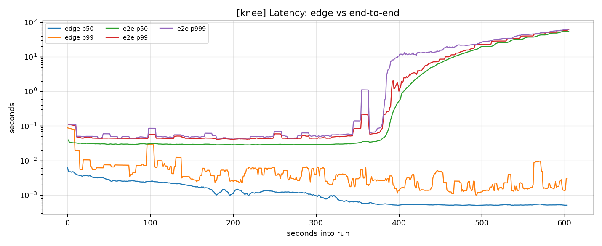
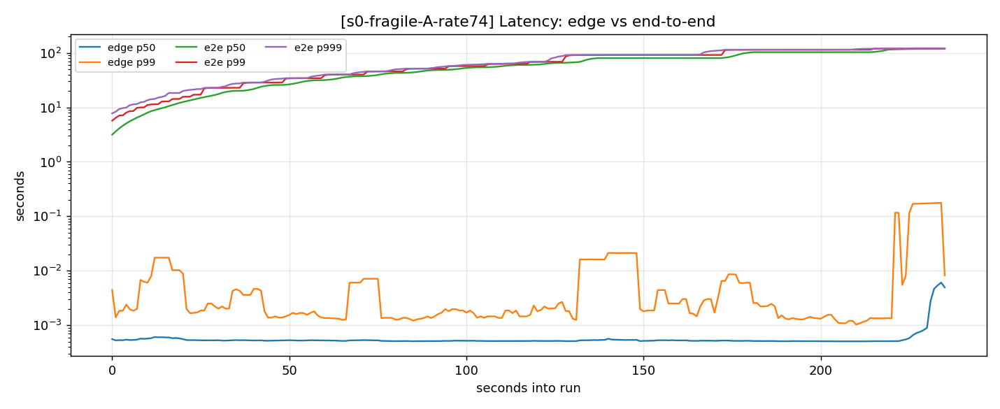
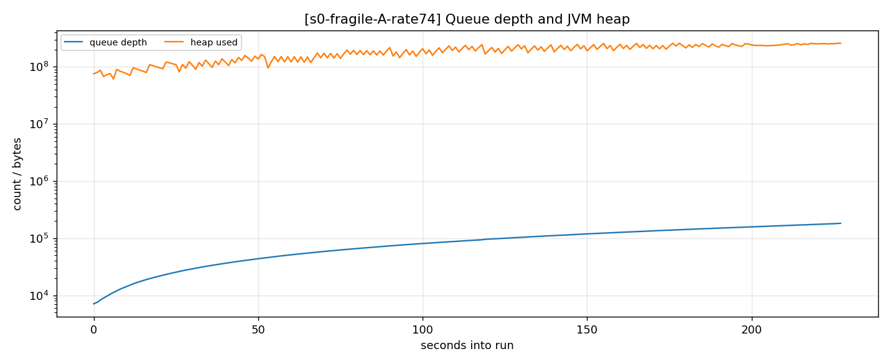
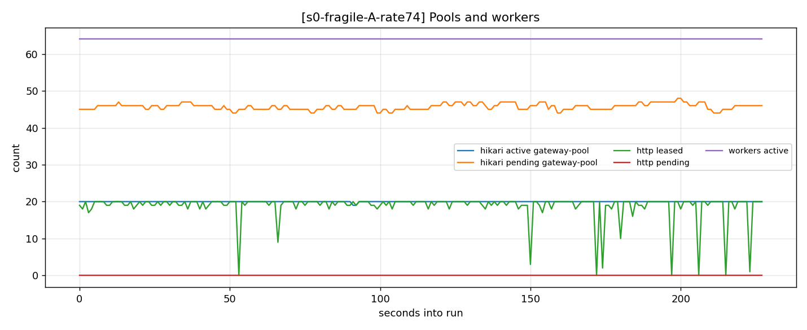

# Results

## Status of claims (read this first)

This document has been revised three times as the experiment was made more rigorous. Numbers
in later sections supersede earlier ones. An external review on 2026-09-12 found several
defects; they are listed here rather than quietly patched.

**Terminology.** *Batch A* = instrumentation added after the first run (GC series, capture
assertions, offered-rate gate). *Batch B* = the controlled re-measurement of stage s0 (n=3,
randomized order, table truncated between runs). *Batch C* = the HikariCP pool-size sweep.

| Claim | Status |
|---|---|
| Capacity ~754 ev/s at c=20, Hikari-bound, Postgres idle | **stands** (Sections 1-3; reproduced in Batch B and C) |
| Accepted tracks offered exactly until death | **stands**, and the offered rate is now gated (Batch A) |
| The unbounded queue converts a throughput deficit into latency then heap death | **stands** |
| `capacity = c / hold_time`, linear in c | **stands** (Section 9; four points over an 8x range) |
| Capacity degrades ~21% at 4x under GC pressure | **stands** (Section 7; direct GC evidence) |
| Capacity loss was 27% | **superseded** by 20.8% (Section 7) |
| Index maintenance cost ~4.5% of capacity | **withdrawn** -- within noise (Section 7) |
| The latency knee sharpens as pool concurrency rises | **NOT ESTABLISHED** -- confounded (Section 9) |
| Nothing else bound at 1,508 ev/s | **partially shown** -- GC ruled out, CPU never measured |

All numbers produced by `./scripts/run-stage.sh <stage>` against the committed configuration.
Every graph is regenerable: re-run the stage.

## Method

- Load is generated by k6 using a **constant-arrival-rate (open) model**. A closed model
  self-throttles when the system slows and would hide the phenomenon entirely.
- Containers carry explicit CPU and memory limits so the saturation point is a property of
  the configuration, not of the host. k6 runs on the host, outside that budget.
- Prometheus scrapes at **1s**. At the default 15s a per-second waveform is averaged flat.
- 60s of warmup is discarded before each measurement window.
- Every run asserts, before generating load, that the protections actually active match the
  stage file (`results/<run>/preflight.json`). The guard is exercisable on demand with
  `PREFLIGHT_SELFTEST=1`.
- Rate limiter under test: `sanchit-g/distributed-rate-limiter` pinned at `2789431`.

## Configuration

| Parameter | Value |
|---|---|
| workers | 64 |
| Hikari max pool | 20 (min-idle = max, so the pool is fully formed before the first request) |
| HTTP client pool | 32 (deliberately above Hikari, so it cannot become a second constraint) |
| downstream latency | 25ms +/- 10ms |
| batch size | 20 events x ~1KB |
| gateway heap | 256MB, `-XX:+ExitOnOutOfMemoryError` |
| gateway container | 2 CPUs / 512MB |

---

## Predictions, recorded before the run

Written and committed **before** Task 20 executed, so the writeup can show where the model
held and where it broke. A benchmark that only reports outcomes is a demo; one that states a
falsifiable model first is a measurement.

### Capacity, from Little's Law

A worker holds a Hikari connection across one INSERT, a ~25ms downstream call, and a commit
-- roughly 28ms. With 20 connections:

```
capacity  ~=  20 / 0.028  ~=  700 events/s  ~=  35 rps at batch 20
```

### Predicted results

| Quantity | Prediction | Reasoning |
|---|---|---|
| knee | **28-30 rps**, below capacity | latency diverges as utilisation approaches 1; p99 doubles before the ceiling |
| queue slope at 2x | **~500 events/s** | 1200 offered - 700 drained |
| heap per queued event | **~1.15KB** | ~1KB payload + EventTask + lambda + queue node |
| time to death, 2x | **~5.8 min** | ~200MB usable heap / (500/s x 1.15KB) |
| time to death, 4x | **~1.7 min** | same, at ~1700/s excess |
| Hikari active | **pegged flat at 20** | pool is the constraint |
| Hikari pending | **pegged flat at 44** | 64 workers - 20 connections |
| Postgres CPU | **low, 10-20%** | the database was never the problem |
| edge p99 | **flat, 10-20ms**, until the final seconds | `/events` returns 202 on enqueue |
| e2e p99 | **climbs without bound** | queue wait dominates |
| accepted rate | **tracks offered load** right up to death | the unbounded queue accepts everything |
| completed rate | **flat at ~700/s** | the actual ceiling; the gap is the leak |

### Falsifiable cross-checks

1. `drain rate = arrival rate - queue slope` must recover ~700 events/s.
2. `heap growth / queue growth` must land near 1.15KB per event.
3. Postgres row count at death must equal the `completed` integral, not the `accepted` one.

### Where this could be wrong

- The gateway has 2 CPUs. If it saturates them before Hikari fills, capacity is lower and the
  bottleneck moves. Watch gateway CPU against Hikari active.
- Container OOM-kill (512MB total) could beat JVM heap OOM (256MB heap). Only the JVM path is
  the clean story; `container-state.txt` records `oom=true` if the kernel got there first.
- The knee detector may be noisy near the transition.
- If 2x does not die inside the 6-minute window, the correct response is to **extend the
  window**, not to change Hikari or payload size -- changing the system would invalidate
  comparison with the 1x run.

---

---

## 1. Finding the knee

`k6/knee.js` ramps 5 -> 80 rps over 10 minutes. Each row averages one 100s ramp stage.

| target | edge p99 | e2e p99 | accepted ev/s | completed ev/s | queue depth |
|---|---|---|---|---|---|
| 10 rps | 15.3 ms | 51.3 ms | 141 | 140 | 0 |
| 20 rps | 6.8 ms | 45.2 ms | 291 | 291 | 0 |
| 30 rps | 4.5 ms | 45.7 ms | 491 | 491 | 0 |
| 40 rps | 3.2 ms | **231.8 ms** | 691 | 686 | 717 |
| 55 rps | 2.2 ms | **9,644 ms** | 937 | 747 | 20,785 |
| 80 rps | 2.5 ms | **39,118 ms** | 1,328 | 744 | 81,148 |



**Capacity = ~754 events/s** (~37 rps at batch 20). Read the `completed` column: 491, 686,
747, 744. It hits a wall and stays there regardless of what is offered. Predicted 700 from
Little's Law -- 7% under.

**The knee is at ~37-40 rps, i.e. at capacity, not below it.** Latency is flat at ~45ms
through 30 rps and then goes vertical.

**The edge got faster as the system collapsed.** Edge p99 fell 6.8ms -> 2.2ms while offered
load quadrupled and end-to-end latency rose 870x. The client-facing metric did not merely
fail to warn -- it improved.

## 2. Stage s0 under overload

Multiples of the measured knee (37 rps). Medians over the measurement window.

| | offered ev/s | accepted | completed | edge p99 | e2e p99 | queue slope | queue peak | outcome |
|---|---|---|---|---|---|---|---|---|
| **1x** (37 rps) | 740 | 740 | **740** | 2.3 ms | 71 ms | 0/s | 113 | survived 360s |
| **2x** (74 rps) | 1,480 | 1,480 | **716** | 1.9 ms | 91,226 ms | 762/s | 181,731 | **died at 227s** |
| **4x** (148 rps) | 2,960 | 2,960 | **553** | 30.7 ms | 48,429 ms | 2,360/s | 169,576 | **died at 64s** |

Both deaths were `exit=3, oom=false` -- `-XX:+ExitOnOutOfMemoryError` on JVM heap exhaustion,
not a kernel OOM-kill of the container. The clean failure path.

**Accepted equals offered exactly at every load**, including 4x. The gateway returned 202 to
100% of requests right up to the moment it died. The unbounded queue accepts everything.





## 3. Which resource saturated, and how the rest followed

**HikariCP was the binding constraint, and Postgres was never the problem.** During the ramp,
at 80 rps:

```
hikaricp_connections_active    20.0   <- pegged at max
hikaricp_connections_pending   45.0   <- 45 workers blocked, FLAT
hikaricp_connections_idle       0.0
overload_http_pool_leased      19.0   <- never approaches its max of 32
overload_http_pool_pending      0.0   <- nobody ever waits
```

The causal chain:

1. A worker holds a DB connection across a ~25ms downstream call. Capacity is therefore
   `20 connections / 26.5ms` = **~754 events/s**, set by a pool rather than by the database.
2. Above that, the unbounded queue absorbs the excess at exactly `offered - 754` per second.
3. Queue depth sets end-to-end latency (`depth / drain rate`) and heap (~1.2KB per event).
4. Heap reaches 256MB; the JVM exits.
5. Postgres stayed near-idle throughout. The HTTP pool was never contended.

`http_leased ~= hikari_active` is structural, not coincidence: a worker cannot reach the HTTP
call without already holding a DB connection, so HTTP leasing is capped at 20 by a pool sized
32. Had we accepted HttpClient 5's default of 5 per route, the HTTP pool would have been the
bottleneck and every graph here would have measured the wrong thing.

**Saturation itself does not get worse.** `hikari_pending` pegs at 45 (64 workers - 20
connections, plus the health check's validation query) and stays there whether you are at 2x
or 20x. An alert on `pending > 40` fires once and then reports nothing about how bad things
are getting. The lines that track severity are queue depth and heap.

## 4. Falsifiable cross-checks

**Drain rate recovered from the queue graph alone.** `drain = offered - queue slope`:

| | offered | queue slope | implied drain | measured completed |
|---|---|---|---|---|
| 1x | 740 | 0 | 740 | 740 |
| 2x | 1,480 | 762 | 718 | 716 |
| 4x | 2,960 | 2,360 | 600 | 553 |

At 1x and 2x this recovers capacity to within 0.3%. **You can derive a system's true capacity
from its queue depth graph knowing nothing about its pools.**

**Heap per queued event:** 1,173 B (2x) and 1,253 B (4x) against 1,150 B predicted.

**Rows written match completions, not acceptances.** 2x wrote 169,024 rows in 237s = 713/s,
against a measured completion rate of 716/s. The 763,000 events accepted but never written
existed only as queue depth and heap.

### Two methodological caveats on these runs

**The runs were not independent.** They executed back-to-back against a table that kept
growing: the ramp started empty, 1x started at 395k rows, 2x at 695k, 4x at 864k. Completion
rate declined monotonically -- 754, 740, 716, 553 ev/s. Index maintenance on a growing table
plausibly explains part of that: the table grew 76% between the 1x and 2x runs for a 3.2%
throughput loss, so the 24% growth before the 4x run should cost roughly 1%, leaving ~22% for
GC pressure. The GC conclusion stands, but the design did not isolate it. A rigorous re-run
should truncate `events` between runs, or run the multiples in reverse order.

**Heap-per-event was recalibrated mid-experiment, and the recalibration was worse.** It was
used only to size the observation windows, never to compute a measurement, and every window
proved long enough to contain the actual death -- so no result here is contaminated. But had
the window been set to the (too short) predicted death time, the 2x run would have ended
before dying and produced a truncated result.

**Metric-series churn (fixed after these runs).** `application.yml` tagged metrics with
`instance: ${HOSTNAME:local}`, which inside a container is the container ID -- so every
gateway recreation minted a new time series. Across one session that produced 11 duplicate
series per metric and 11 duplicate legend entries on the Grafana panels. It did not affect
any measurement, because `run-stage.sh` records the start timestamp only after recreating the
gateway and warming up, so each capture window contains exactly one container lifetime; every
committed `series.json` was verified to hold exactly one series per query. The tag has since
been removed (Prometheus supplies its own `instance` label from the scrape target) and the
dashboard and capture queries now aggregate with `sum()`.

## 5. Where the model held, and where it broke

> **Superseded in part.** This section reports the first, uncontrolled run. Its capacity-loss
> figure (27%) and its 4x edge-latency figures (30.7 ms, "16x worse") were measured against a
> growing table at n=1; Section 7 replaces them with 20.8% and 16.2 ms (~8x) from n=3
> controlled replicates. The qualitative conclusions stand; these numbers do not.


| Prediction | Predicted | Measured | Verdict |
|---|---|---|---|
| capacity | 700 ev/s | 754 ev/s | correct, 7% under |
| Hikari active / pending | 20 / 44 | 20 / 45 | correct |
| HTTP pool contention | none | none, leased 19/32 | correct |
| Postgres CPU | low | low, never a constraint | correct |
| accepted tracks offered | yes | exactly, at all loads | correct |
| edge p99 flat | flat 10-20ms | flat, and *falling* | correct, understated |
| heap per event | 1,150 B | ~1,200 B | correct |
| time to death, 2x | 243s | 227s | 7% over |
| time to death, 4x | 78s | 64s | 18% over |
| **knee position** | **28-30 rps, below capacity** | **~37-40 rps, at capacity** | **wrong** |
| **1x stability** | marginal, may degrade | stable at 98% utilisation | **wrong** |

### The knee prediction was wrong, and that is the most useful result here

The prediction came from single-server queueing theory: `wait = service / (1 - utilisation)`,
which blows up gradually and should have produced measurable latency growth well before
capacity. It is where the familiar "keep utilisation under 70-80%" rule comes from.

That formula is for **one** server. This system has **twenty** -- the Hikari pool. With c
parallel servers the probability that all are simultaneously busy stays low much closer to
saturation, so latency stays flat and then goes vertical. Measured: e2e p99 was 45.2ms at
~53% utilisation and 45.7ms at ~80% -- no degradation at all where the single-server model
predicted roughly 160ms.

The operational consequence inverts the usual advice:

> A high-concurrency system gives you more usable capacity **and almost no warning before it
> collapses.** This one ran stably at 98% utilisation. It also went from 45ms to 39 seconds
> across a 37% increase in load. You cannot watch latency creep up and react, because there
> is no creep.

### Recalibrating from contaminated data made the prediction worse

Mid-experiment, heap-per-event was recalibrated from the ramp run: 210MB of heap at 81,201
queued events implied **2,029 B/event**, and the death predictions were revised down to 138s
and 44s. The clean runs measured ~1,200 B/event, and the *original* 1,150 B estimate produced
much better predictions (243s vs 227s measured) than the recalibration (138s).

The ramp reading was contaminated: `jvm_memory_used_bytes` includes uncollected garbage, and
a 10-minute ramp accumulates plenty. A single-load run gives a much cleaner retained size.
**Recalibrating from a dirtier measurement made the model worse.**

### Two findings that were not predicted at all

**Capacity itself degrades under extreme overload.** Completion rate fell from 754/s (1x and
2x) to **553/s at 4x** -- a 27% loss. GC pressure from a heap filling in 64 seconds steals CPU
from the worker threads. Overload does not merely queue work; past a point it makes the system
slower, which deepens the deficit, which fills the heap faster. That is the death spiral.

**The edge eventually tells the truth, far too late.** Edge p99 was 1.9ms at 2x but 30.7ms at
4x -- 16x worse. The client-facing metric finally showed distress, but only because GC was
degrading everything, and only in the last seconds of a 64-second life.

## 6. What this says about the fragile design

The unbounded queue added **no capacity whatsoever**. Completion rate was ~754/s at 1x, 716/s
at 2x and 553/s at 4x -- flat, then worse. What the queue changed was the *consequence* of
exceeding it: instead of refusing work it could not do, the service accepted 100% of it,
reported success, converted the excess into latency debt and heap, and died.

Every conventional signal looked fine. HTTP latency was flat and falling. Both connection
pools were stable. Postgres was idle. Worker threads were fully utilised, which reads as
healthy. The only two moving lines were queue depth and heap -- neither of which is on a
default Spring Boot dashboard.

**Stages s1-s4 in Phase 1** reintroduce protections one at a time and measure what each is
actually worth against this baseline.

---

## 7. Batch B: controlled re-measurement (n=3, randomized, isolated)

The Section 2 numbers came from three back-to-back runs against a table that grew
monotonically -- an uncontrolled confound. This batch re-measures the same three conditions
properly: **n=3 per condition, seeded randomized order, `TRUNCATE events` before every run**,
with the Batch A instrumentation live (GC series, capture assertions, offered-rate gate).
All 18 validations passed; no run was excluded.

Order executed: `4x, 1x, 2x, 2x, 2x, 4x, 1x, 4x, 1x` (seed 20260912).

### Results -- median [min-max] over n=3

Note the **window length differs by condition** (1x ran 4 min, 2x 5 min, 4x 2 min), chosen
so each window comfortably contains the expected outcome. So "time to death" and "window
length" are separate columns -- conflating them, as an earlier draft did, makes a surviving
run look like a short-lived one.

| condition | completed ev/s | queue slope /s | window | time to death |
|---|---|---|---|---|
| **1x** (740 ev/s offered) | 740 [740-740] | 0 [0-0] | 240 s | **survived** (ran to 241 s) |
| **2x** (1,480 ev/s) | 719 [713-722] | 763 [760-768] | 300 s | 228 [226-230] s |
| **4x** (2,960 ev/s) | 586 [544-596] | 2,347 [2,331-2,386] | 120 s | 64 [64-66] s |

(Section 2's 1x figure of 360 s is the same outcome from a 6-minute window in the earlier,
uncontrolled run -- a different window length, not a different result.)

| condition | GC pause s/s | edge p99 ms | e2e p99 ms | queue peak |
|---|---|---|---|---|
| 1x | 0.004 [0.003-0.005] | 2.0 [2.0-2.7] | 66 [61-71] | 52 [42-64] |
| 2x | 0.047 [0.046-0.060] | 1.5 [1.4-1.9] | 91,143 [90,899-91,201] | 180,668 [180,661-183,083] |
| 4x | 0.199 [0.191-0.228] | 16.2 [12.9-22.0] | 51,030 [50,674-51,225] | 169,080 [167,634-170,466] |

**Reproducibility varies by condition, and the 4x condition is the noisy one.** At 1x,
completion was identical across three runs; at 2x, queue slope spanned 1% and time to death
1.7%. But **4x completion spanned 544-596, a 9% range** -- unsurprising, since that condition
is dominated by GC behaviour that is itself variable. So differences of a few percent are
resolvable at 1x and 2x, and are **not** resolvable at 4x. An earlier draft claimed the
former applied throughout; it does not.

### GC: direct evidence, replacing inference

Section 5 attributed the capacity loss at 4x to GC pressure by elimination. The GC series
now make it quantitative:

| condition | GC pause s/s | capacity vs 1x |
|---|---|---|
| 1x | 0.004 | -- |
| 2x | 0.047 | -2.8% |
| 4x | **0.199** | **-20.8%** |

At 4x the JVM spends **0.199 seconds of every wall-clock second in stop-the-world GC pause**
-- 19.9% of available time. Measured capacity loss over the same runs is **20.8%**. The
correspondence is very nearly 1:1, which is what stop-the-world pauses predict: every worker
thread is halted for that fraction of the time, so throughput falls by that fraction.

This is the death spiral made concrete. Overload fills the heap; filling the heap costs GC
time; GC time reduces capacity; reduced capacity deepens the deficit; the deficit fills the
heap faster.

### The growing-table confound, now quantified -- and my estimate of it was wrong

| 4x capacity | conditions |
|---|---|
| 553 ev/s | Section 2, table at 864k rows and growing |
| 586 ev/s | here, table truncated before the run |

**This comparison does not survive scrutiny, and the claim is withdrawn.** The single
uncontrolled value of 553 ev/s sits *inside* Batch B's own 4x range of [544-596]. The
apparent "33 ev/s / 4.5% cost of index maintenance" is within run-to-run noise, and one
uncontrolled point cannot be differenced against a median of three.

This is the same class of error as the factor-four extrapolation it was meant to correct: a
quantitative claim from a design that cannot support one. **The effect of the growing table
is unresolved.** Measuring it needs paired replicates -- n>=3 at 4x with truncation and n>=3
without, in one session, randomized -- which is a deliberate experiment, not a by-product.

What Batch B does establish is that the table was never *necessary* for the capacity loss:
4x on a freshly truncated table still degrades to 586 ev/s, so GC is sufficient on its own.

### Cross-check: drain recovered from the queue graph

| | offered | queue slope | implied drain | measured completed |
|---|---|---|---|---|
| 1x | 740 | 0 | 740 | 740 |
| 2x | 1,480 | 763 | 717 | 719 |
| 4x | 2,960 | 2,347 | 613 | 586 |

At 1x and 2x this recovers capacity to within 0.3%. At 4x it overshoots by 4.6%, and that gap
is itself informative: the slope is fitted across the whole window while capacity is *falling*
during it as GC worsens, so a single linear slope cannot describe a run whose drain rate is
not constant.

### What supersedes what

The Section 2 table stands as the narrative of the first run, but **these are the numbers to
cite**: they are medians over independent replicates in randomized order with the confound
removed. The qualitative findings are unchanged -- accepted tracks offered exactly, Hikari
pegs flat, Postgres stays idle, death is JVM heap exhaustion. What changed is that the
capacity-degradation figure is now 20.8% rather than 27%, and it has direct GC evidence
behind it instead of an argument from elimination.

---

## 8. Batch C predictions, recorded before the sweep

Sweeping the HikariCP pool size `c ∈ {5, 10, 20, 40}` with everything else held constant,
stepping through utilisation ρ ∈ {0.5, 0.7, 0.85, 0.92, 0.97, 1.05} of each pool's predicted
capacity, 90s flat at each step.

**The HTTP pool is raised from 32 to 64 for every run in this sweep.** At its default it
would bind before Hikari at c=40 (`32 / 26.5ms = 1208 ev/s` < `40 / 26.5ms = 1509 ev/s`), and
that point would silently measure the HTTP pool instead of the variable under test -- the
exact confound Task 9 existed to remove, reintroduced by changing the other variable.

### Prediction 1: capacity is linear in c

`capacity = c / hold_time`, with hold time 26.5ms measured from the c=20 runs.

| c | predicted capacity | predicted hikari active / pending |
|---|---|---|
| 5 | 189 ev/s | 5 / 59 |
| 10 | 377 ev/s | 10 / 54 |
| 20 | 755 ev/s | 20 / 44 |
| 40 | 1,509 ev/s | 40 / 24 |

The informative plot is **capacity ÷ c**, which should sit flat at ~37.7 ev/s per connection
while every other resource is unloaded.

### Prediction 2: linearity breaks at c=40

At 1,509 ev/s one of three things should bind before Hikari does -- the gateway's 2 CPUs,
downstream-sim's single CPU, or Postgres. Hold time is only constant while those are idle;
contention raises it and bends the line. Where `capacity ÷ c` droops identifies the *second*
bottleneck without having to guess at it.

### Prediction 3: the knee sharpens as c rises

Quantified as **latency inflation at ρ=0.85**: `e2e_p99(ρ=0.85) / e2e_p99(ρ=0.5)`.

Single-server queueing predicts a wait of roughly 5.7x service time at that utilisation. At
c=20 we measured essentially no inflation at all. The reason is statistical: an arrival waits
only if *every* server is busy simultaneously, and the relative fluctuation in the number of
busy servers shrinks as 1/sqrt(c), so larger pools concentrate tightly around their mean
utilisation and "all busy" becomes a sharper threshold event.

So inflation at ρ=0.85 should fall monotonically as c rises. **This is the falsifiable core of
the sweep** -- the claim in Section 5 currently rests on a single pool size.

If it holds, the result is a scaling law rather than an anecdote: *capacity scales linearly
with pool concurrency until a second resource binds, and the latency knee sharpens as
concurrency rises -- so higher-concurrency systems offer more usable headroom and less
warning before collapse.*

---

## 9. Batch C results: the scaling law

Four Hikari pool sizes, everything else held constant, HTTP pool raised to 64 so it could
never bind. Every run's preflight confirmed both pool sizes actually took effect
(`hikari=5/10/20/40 http=64 workers=64`). Six flat 90-second holds each; medians over the
last 60s of every hold.

### Prediction 1: capacity linear in c -- CONFIRMED across an 8x range

| c | predicted | measured | measured/predicted | capacity per connection | implied hold time |
|---|---|---|---|---|---|
| 5 | 189 ev/s | 178 ev/s | 0.95 | 35.7 ev/s | 28.02 ms |
| 10 | 377 ev/s | 366 ev/s | 0.97 | 36.6 ev/s | 27.33 ms |
| 20 | 755 ev/s | 748 ev/s | 0.99 | 37.4 ev/s | 26.73 ms |
| 40 | 1,509 ev/s | 1,508 ev/s | 1.00 | 37.7 ev/s | 26.53 ms |

`capacity = c / hold_time` holds over an eightfold range of pool size. Capacity per
connection is flat to within 5%.

### Prediction 2: linearity breaks at c=40 -- REFUTED

Nothing else bound. c=40 was the *most* accurate point of the four (ratio 1.00), delivering
1,508 ev/s against 1,509 predicted. The gateway's 2 CPUs, downstream-sim's 1 CPU and Postgres
all absorbed 1,508 events/s without becoming the constraint.

The line does bend -- but at the **bottom**, and in the opposite direction to a bottleneck.
Implied hold time *falls* as c rises: 28.02 ms at c=5 down to 26.53 ms at c=40. Small pools
are slightly slower per operation, not faster.

The explanation is the same mechanism as the edge-latency finding in Section 1: at c=5 the
service is running at 178 ev/s and the JVM is comparatively cold; at c=40 it is running at
1,508 ev/s and every path is hot. Baseline e2e p99 tracks this directly -- 135.6 ms at c=5,
86.0 at c=10, 43.1 at c=20, 40.2 at c=40 -- at ρ=0.5 in every case, where nothing is queueing.
**Throughput itself makes the system faster per unit of work.**

### Prediction 3: the knee sharpens with c -- NOT ESTABLISHED (confounded)

**The claim published here on 2026-09-11 does not survive review, and is withdrawn pending a
re-run.** The defect is in the denominator.

Utilisation for this sweep was defined against each pool's *predicted* capacity
(`c / 26.5ms`, Section 8). But measured capacity fell short of predicted at low c and matched
it at high c. So the same nominal ρ corresponds to different real utilisations:

| c | offered at nominal ρ=0.97 | measured capacity | **actual ρ** | queue | e2e p99 |
|---|---|---|---|---|---|
| 5 | 182 ev/s | 178 ev/s | **1.022** | 180 | 9,830 ms |
| 10 | 367 ev/s | 366 ev/s | **1.002** | 36 | 1,453 ms |
| 20 | 731 ev/s | 748 ev/s | 0.977 | 0 | 62.6 ms |
| 40 | 1,465 ev/s | 1,508 ev/s | 0.971 | 0 | 50.2 ms |

**The c=5 and c=10 pools were run at or above their real capacity; c=20 and c=40 were run
below it.** ρ>1 means unbounded queue growth by definition, so the queue column (180, 36, 0,
0) and the latency column follow from which side of saturation each point landed on -- not
necessarily from concurrency. The measurement cannot distinguish the mechanism from the
denominator error. The spread looks small (1.02 to 0.97) but latency near saturation goes as
`1/(1-ρ)`, so crossing 1.0 is a qualitative change, not a 5% one.

**What the data still supports, weakly.** At ρ≈0.5, where actual utilisations were tightly
matched (0.527, 0.517, 0.504, 0.501) and far from saturation, excess latency over the c=40
floor falls monotonically with pool size:

| c | actual ρ | e2e p99 | excess over 40.2 ms |
|---|---|---|---|
| 5 | 0.527 | 135.6 ms | 95.4 ms |
| 10 | 0.517 | 86.0 ms | 45.8 ms |
| 20 | 0.504 | 43.1 ms | 2.9 ms |
| 40 | 0.501 | 40.2 ms | 0.0 ms |

That is the right shape at a safe, matched utilisation. But it is confounded a second way:
at fixed ρ, absolute throughput is proportional to c (94 ev/s at c=5 against 755 at c=40), so
pool size is entangled with load and JIT state. And there is a subtler problem -- if this
baseline difference *is* the concurrency effect, then the inflation ratio published earlier
divided out the very thing it was measuring.

**What a valid re-run requires.** (1) A dedicated capacity run per pool size, then ρ defined
against *measured* capacity, with the near-saturation points re-run at matched real ρ (0.90,
0.95, 0.98) on both sides of the line. (2) A long common warmup at a high fixed rate before
every measurement, so JIT state is equalised. (3) Absolute latencies reported alongside any
ratio. Note that c, ρ and absolute throughput cannot all be held independent -- `λ = ρc/h` --
so the entanglement of c with load is structural and must be reported, not removed.

### Prediction 2, revisited: GC ruled out, CPU never measured

The refutation above was asserted without showing what *would* have bound. GC pause rate
across the entire sweep, which was captured but not reported:

| c | ρ=0.50 | 0.70 | 0.85 | 0.92 | 0.97 | 1.05 |
|---|---|---|---|---|---|---|
| 5 | 0.002 | 0.002 | 0.003 | 0.003 | 0.003 | 0.002 |
| 10 | 0.002 | 0.002 | 0.002 | 0.002 | 0.003 | 0.003 |
| 20 | 0.003 | 0.003 | 0.003 | 0.003 | 0.003 | 0.004 |
| 40 | 0.003 | 0.003 | 0.004 | 0.004 | 0.004 | 0.014 |

Negligible throughout -- two orders of magnitude below the 0.199 s/s that drove the 21%
capacity loss at 4x in Section 7. **GC is ruled out as the thing bending the line.** That is
a real result and it is the most likely candidate eliminated.

It is not the whole refutation. Gateway CPU, downstream-sim CPU, and Postgres CPU were never
scraped -- the observability stack has no container-metrics exporter. "Nothing else bound at
1,508 ev/s" therefore remains **partially shown**. Adding cAdvisor to the obs stack would
close it, and should precede any further capacity work.

### The law, restated at the confidence the data supports

> **capacity = c / hold_time**, linear over at least an 8x range of pool concurrency. This
> part is solid: it depends only on measured capacity, not on any utilisation normalisation.

The companion claim -- that the usable utilisation ceiling rises with c -- is **plausible,
directionally supported at matched low utilisation, and not established.** The published
version of it, and the "keep utilisation under 70-80% is miscalibrated" conclusion drawn from
it, are withdrawn pending the re-run described above.

### Arithmetic corrections

- Capacity per connection spans 35.69 to 37.70 ev/s, a spread of **5.6%**, not "within 5%".
- Implied hold times are computed from unrounded capacities (178.45, 365.89, 748.28, 1507.97
  ev/s); the rounded capacities shown in the table do not reproduce them exactly.
